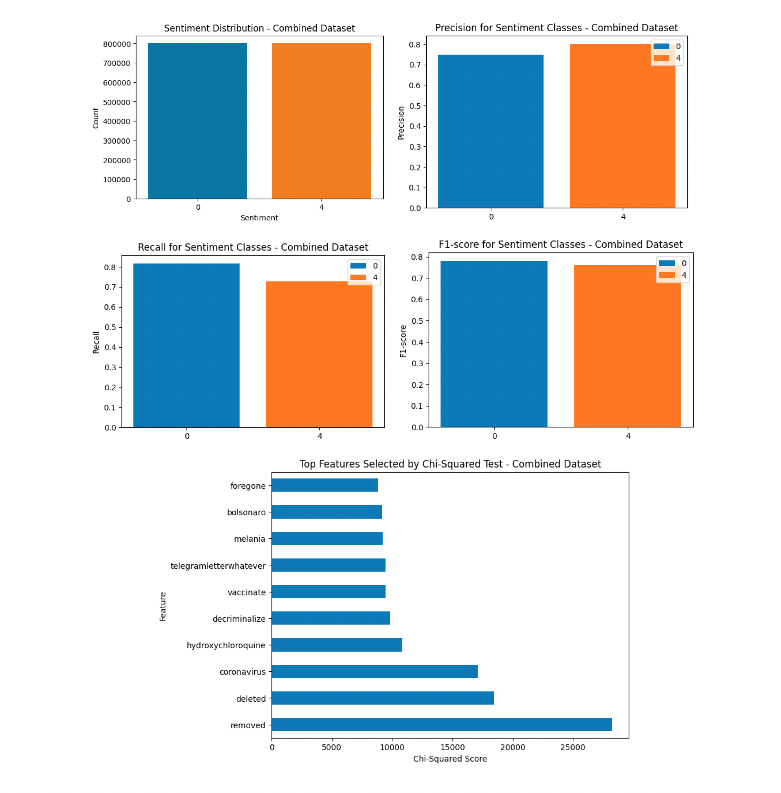
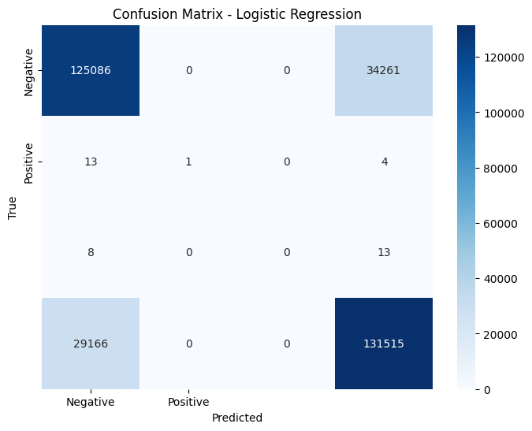
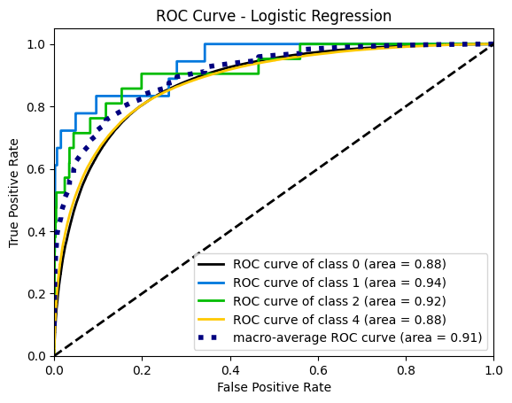
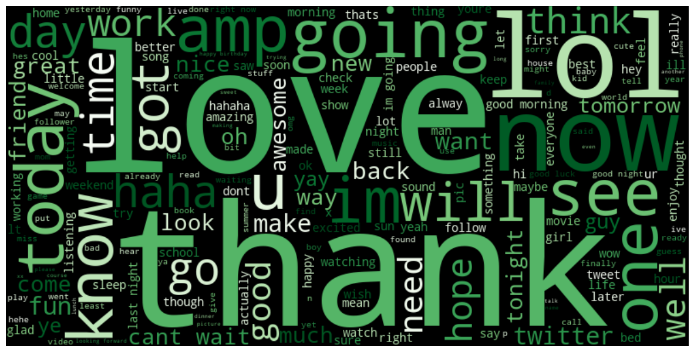
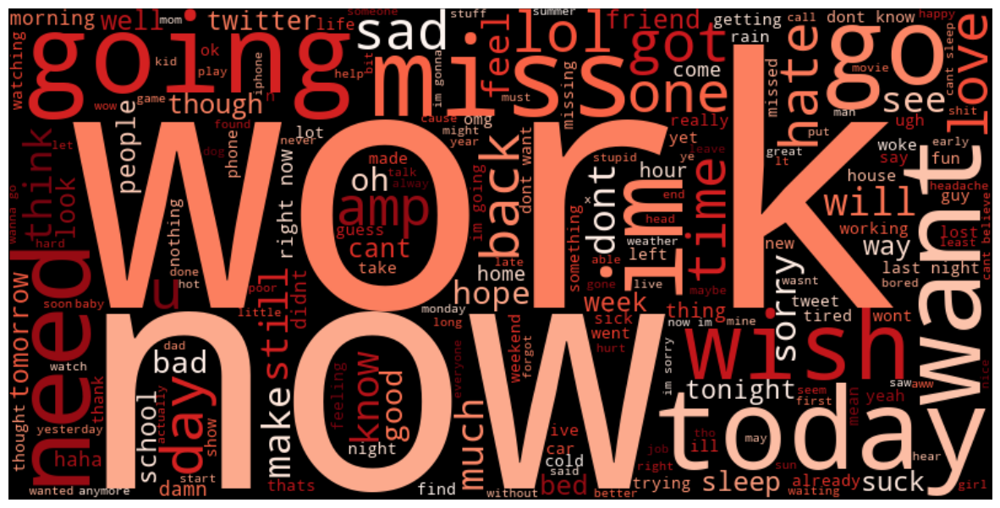

Sentiment Analysis of Social Media Data
## Introduction/ Background
Social media platforms, a staple of modern communication, offer massive amounts of data that reflect public sentiment. Sentiment analysis, a subfield of natural language processing (NLP), aims to decipher these sentiments from raw textual data. Over the years, several studies, including works by Pak & Paroubek (2010) and Go, Bhayani & Huang (2009), have explored sentiment analysis on Twitter. In this project, our goal is to expand on this existing knowledge, delving into sentiment analysis across a broader spectrum of platforms like Twitter and Reddit, harnessing the potential of these massive datasets to provide a richer, more nuanced understanding of public opinions.

## Problem Overview
In a world saturated with online interactions, capturing the genuine essence of public sentiment across diverse social media platforms poses a complex challenge. The motivation driving this project stems from the desire to gain a deeper understanding of public opinion on specific topics, events, or products. This insight is invaluable for brand monitoring, allowing businesses to gauge how their brand is perceived and how effectively they're engaging with their audience. Furthermore, these sentiments provide a foundation for market research, facilitating insights into market trends, offering feedback, and empowering businesses with a competitive edge. One of the more crucial aspects we aim to tackle is crisis detection, which involves monitoring shifts in sentiment to identify and address potential crises proactively.

## Data Collection/ Methods
### Data Collection:
- Data for the Twitter dataset was already included as a link. For the Reddit Comments however, there was an API pull to extract comments. Our group chose to pull data from some of the most popular posts from r/news, as we thought that was the best way to get the most variety of comments in both negative and postive sentiments. 
### Data Pre-processing: 
- Cleaned the data by defining columns, dropping the 'flag' column, and applying text pre-processing to the 'text' column by converting text to lowercase and removing URLs and non-alphabetic characters. This step ensures that the textual data is standardized and cleaned for further analysis.
### Feature Selection: 
- TF-IDF (Term Frequency-Inverse Document Frequency) for text feature extraction. The TfidfVectorizer is utilized to transform the text data into numerical feature vectors. Moreover, it applies SelectKBest with a chi-squared test as the score function to select the top 10 best features, considering their relationship with the target variable ('target').
### Naive Bayes Classifier: 
- The code instantiates and fits a Multinomial Naive Bayes classifier (MultinomialNB) using the selected features and target labels. It then predicts on the test set and evaluates the model's performance. The performance metrics like accuracy, precision, recall, and F1-score are calculated using classification_report.
### Logistical Regression:
Logistic Regression is a classification algorithm that is widely used in machine learning. Despite its name, it is used for binary classification problems, where the target variable has two classes. Logistic Regression models the probability that a given instance belongs to a particular class.

## Results and Discussion
### 1. Data:
- The evaluation was conducted using the Multinomial Naive Bayes classifier, assessing its performance in sentiment analysis on Twitter and Reddit sentimental data. The metrics used for evaluation included precision, recall, and F1-score, providing a comprehensive understanding of the model's effectiveness in differentiating sentiments.

  
  
1. __Model Performance (Bayes)__: 
    - The Multinomial Naive Bayes model achieved an accuracy of approximately 77.15%, performing moderately well in differentiating sentiments.

2. __Precision and Recall__:
    - For the 'Negative' sentiment (0), the model obtained a precision of 75% and recall of 82%. This indicates that among the predicted 'Negative' sentiments, 75% were accurate, and it identified 82% of the actual 'Negative' sentiments.
    - For the 'Positive' sentiment (4), the precision and recall were 80% and 73%, respectively. This suggests a similar trend in predicting 'Positive' sentiments.

3. __F1-Score__: 

    The F1-score, which considers both precision and recall, is around 0.78 for 'Negative' and 0.76 for 'Positive' sentiments. These scores represent a balance between precision and recall for each sentiment class.

    The results exhibited an overall accuracy of around 77.15%. The precision, recall, and F1-scores for 'Negative' and 'Positive' sentiments were also derived, indicating the model's ability to correctly classify these sentiments.

    The results are reasonably satisfactory, especially in distinguishing 'Positive' sentiments. However, there are limitations in correctly identifying 'Negative' sentiments, leading to a slight imbalance in performance between the sentiment classes. To improve results, work could focus on enhancing the model's capability to detect 'Negative' sentiments. Techniques like re-balancing the dataset, exploring different algorithms, or feature engineering might aid in rectifying this imbalance.

    While the current method achieved a decent level of accuracy, a comparative analysis against other sentiment analysis algorithms or more complex models could provide deeper insights into the strengths and weaknesses of the Naive Bayes approach. Comparing against alternative models could highlight areas for potential improvement and optimization.

    The visualizations, such as the classification report and performance metrics, proved to be highly relevant. They provided a clear understanding of the model's performance across sentiment classes. However, expanding the visual analysis to include comparative evaluations against other models might further enhance the understanding of the project's approach and ideas.

### __Model Analysis(Logistic Regression)__:

### Class 0 (Negative Sentiment):
1. Precision: 81%, Out of all instances predicted as negative sentiment, 81% were correct.
2. Recall: 78%, Out of all actual negative sentiments, the model identified 78% correctly.
3. F1-Score: 80%, The harmonic mean of precision and recall for negative sentiment is 80%.

### Class 1 (Not mentioned in the context):
1. Precision: 100%, This class has perfect precision. However, the recall is very low, suggesting that the model identified only a small percentage of actual instances of this class.
2. Recall: 6%, Only 6% of actual instances of this class were correctly identified by the model.
3. F1-Score: 11%, The F1-Score reflects a low balance between precision and recall.

### Class 2 (Not mentioned in the context):
1. Precision: 0%, The model did not correctly identify any instances of this class.
2. Recall: 0%, None of the actual instances of this class were correctly identified by the model.
3. F1-Score: 0%, The F1-Score is 0 due to zero precision and recall.

### Class 4 (Positive Sentiment):
1. Precision: 79%, Out of all instances predicted as positive sentiment, 79% were correct.
2. Recall: 82%, Out of all actual positive sentiments, the model identified 82% correctly.
3. F1-Score: 81%, The harmonic mean of precision and recall for positive sentiment is 81%.

### Overall Metrics:
1. Accuracy: 80%, The overall accuracy of the model in correctly predicting all classes is 80%.
2. Macro Average F1-Score: 43%, The macro-average F1-score gives equal weight to all classes, providing a balanced measure across classes.
3. Weighted Average F1-Score: 80%, The weighted average F1-score considers class imbalance, giving more weight to the majority class.

### Project Conclusion:

### Logistic Regression Model:
The Logistic Regression model, introduced in the final report, provided valuable insights into sentiment classification. While achieving an overall accuracy of 80%, it demonstrated strengths in distinguishing between 'Negative' and 'Positive' sentiments. However, challenges arose with classes not explicitly mentioned in the context, specifically Class 1, where recall was notably low at 6%. This indicates the model's struggle to identify instances of this class, even though it achieved perfect precision.

### Areas for Improvement:
1. Handling Class Imbalance: The new model reinforces the need to address imbalances in classes, particularly for those not explicitly mentioned in the context (Class 1 and Class 2). Consider dataset re-balancing techniques to improve model performance on minority classes.
2. Exploring Diverse Algorithms: As recommended in the midterm report, exploring alternative algorithms remains crucial. While Logistic Regression has strengths, comparative analyses with other sentiment analysis models could reveal alternative approaches with better performance.
3. Feature Engineering: Experiment with feature engineering techniques to enhance the model's ability to accurately detect 'Negative' sentiments. This may involve extracting additional features from the text or refining existing ones.

### Future Directions:
1. Comparative Analyses: Extend comparative analyses with alternative sentiment analysis algorithms, as suggested in the midterm report. Evaluating the strengths and weaknesses of different models can guide the selection of the most suitable approach for the project's goals.
2. Enhanced Visualizations:Acknowledge the insights gained from visualizations in the final report and consider expanding comparisons. Visualizations play a pivotal role in conveying complex information, and a more comprehensive visual analysis could provide deeper insights into model performance.

### Conclusion:
The combination of insights from the midterm report as well as findings from our new model highlights the project's progress and areas for improvement. While achieving a commendable accuracy, the emphasis on addressing class imbalances, exploring diverse algorithms, and implementing feature engineering stands as a roadmap for enhancing the sentiment analysis model. 
In conclusion, our sentiment analysis project not only provides valuable insights into public opinions across social media platforms but also establishes a foundation for ongoing refinement, ensuring the continuous evolution and effectiveness of our models in understanding and interpreting the dynamic landscape of user sentiments.
  
#### Additional Visualizations:

   
   

## References
- Pak, A., & Paroubek, P. (2010). Twitter as a Corpus for Sentiment Analysis and Opinion Mining. LREC. Link
- Go, A., Bhayani, R., & Huang, L. (2009). Twitter Sentiment Analysis. Proceedings of the International Conference on Computational Linguistics. Link
- Agarwal, B., & Mittal, N. (2012). Sentiment Analysis of Twitter Data. International Journal of Computer Science and Information Technologies.

Data Sets: 
- [Twitter Sentiment140](https://www.kaggle.com/datasets/kazanova/sentiment140)
- [Reddit Comments Dataset](https://www.reddit.com/dev/api/)

